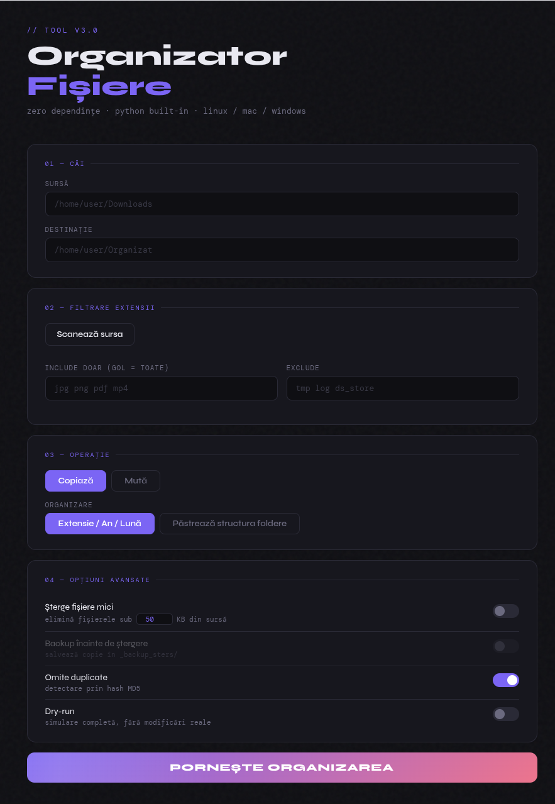

# 📁 FileFlow

> A file organizer with a modern web UI — zero external dependencies, single Python file.


---

## Demo



FileFlow runs entirely on your machine (`127.0.0.1`) — there's no hosted live
demo, since the tool reads and moves/deletes files based on paths you type in,
which wouldn't be safe to expose on a public server. Run it locally instead:
see [Getting started](#getting-started) below — it takes one command.

---

## What it does

FileFlow scans a source folder and copies or moves its files into a destination
folder, using whichever of the two organizing modes you pick:

**Extension / year / month** (default) — sorts files by type and date, using
the file's actual creation date:

```
Source/                  Destination/
├── photo.jpg            ├── jpg/2024/03-March/photo.jpg
├── report.pdf            ├── pdf/2023/11-November/report.pdf
└── clip.mp4              └── mp4/2024/01-January/clip.mp4
```

**Keep folder structure** — mirrors the source tree exactly, 1:1, with no
reorganizing — only the other options (copy/move, extension filters, small-file
deletion, dedup, dry-run) still apply to decide *which* files get processed:

```
Source/                  Destination/
├── photo.jpg            ├── photo.jpg
└── vacation/             └── vacation/
    └── clip.mp4              └── clip.mp4
```

---

## Features

- **Modern web UI** — opens automatically in your browser, no installation needed
- **Copy or move** — choose what happens to the originals
- **Two organizing modes** — sort by extension/year/month, or mirror the source folder structure exactly, with no reorganizing
- **Filter by extension** — include only `jpg png pdf` or exclude `tmp log`, with checkboxes populated by scanning the actual source folder
- **Delete small files** — configurable size threshold (e.g. under 50 KB), with optional backup
- **Duplicate detection** — via MD5 hash, skips identical files
- **Filename conflict resolution** — automatically appends a suffix if the file already exists
- **Dry-run mode** — full simulation with no actual changes made
- **Live progress bar** — real-time updates as files are processed
- **Interactive report** — filterable and sortable table of all operations performed
- **Zero dependencies** — uses only the Python standard library

---

## Getting started

### Requirements

- Python 3.8+
- Nothing else

### Run

```bash
# Clone the repo
git clone https://github.com/Maggooo/fileflow.git
cd fileflow

# Start
python3 fileflow.py
```

Your browser opens automatically at `http://127.0.0.1:7491`.

### Linux — clean terminal output (suppress GPU/browser noise)

```bash
python3 fileflow.py 2>/dev/null
```

### Stop

Press `Ctrl+C` in the terminal.

---

## How it works

FileFlow spins up a minimal HTTP server using Python's built-in `http.server`, serves the entire web UI as inline HTML/CSS/JS, and exposes four endpoints:

| Endpoint | Method | Description |
|----------|--------|-------------|
| `/` | GET | Serves the web interface |
| `/scaneaza` | GET | Scans the source folder and returns a count of files per extension (requires token) |
| `/start` | POST | Receives config and starts organizing in a background thread (requires token) |
| `/progress` | GET | Returns current state (progress + result) |

The UI polls `/progress` every 400ms until the job is complete. State-changing requests (`/start`, `/scaneaza`) are protected by a random per-run token (`X-FileFlow-Token` header) generated at startup, so only the page served by that instance can trigger them.

If [Pillow](https://pypi.org/project/Pillow/) is installed, FileFlow reads the EXIF `DateTimeOriginal` tag for more accurate photo dates; otherwise it falls back to file timestamps. This is an optional enhancement — the core tool still has zero required dependencies.

---

## Repository structure

```
fileflow/
├── fileflow.py   # everything — server + logic + UI
├── docs/
│   └── screenshot-1.png
├── README.md
├── LICENSE
└── .gitignore
```

---

## License

MIT — see [LICENSE](LICENSE)
